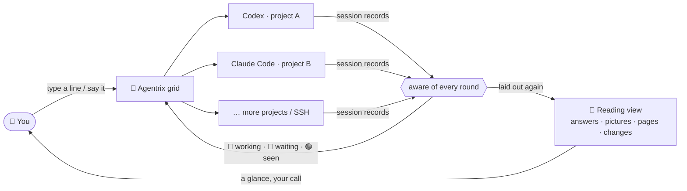

<p align="center">
  <a href="https://github.com/noeigenstate/Agentrix/releases/latest"></a>
</p>

<p align="center"><strong>An AI editor built for what comes next: you stop writing every line and start directing a whole grid of AI.</strong></p>
<p align="center">Codex and Claude Code work on many projects side by side. They build, report and wait for your call.</p>

<p align="center">
  <a href="https://github.com/noeigenstate/Agentrix/releases/latest"></a>
  <a href="https://github.com/noeigenstate/Agentrix/releases"></a>
  
  <a href="LICENSE"></a>
</p>

<p align="center">
  <a href="https://github.com/noeigenstate/Agentrix/releases/latest"><strong>⬇️ Download</strong></a> ·
  <a href="#-at-a-glance">At a glance</a> ·
  <a href="#-how-it-works">How it works</a> ·
  <a href="#-highlights">Highlights</a> ·
  <a href="#-get-started">Get started</a> ·
  <a href="README.md">中文</a>
</p>

<p align="center">
  
</p>
<p align="center"><sub>30-second film · <a href="docs/images/promo.mp4">full quality</a></sub></p>

## ✨ At a glance

<table>
  <tr>
    <td width="33%" valign="top"><h3>🧩 Many at once</h3>Every project is a card with a real terminal. Codex and Claude Code work at the same time, local and SSH projects on the same grid.</td>
    <td width="33%" valign="top"><h3>💡 Lights up when done</h3>It reads the agents' own session records: 🔵 working, 🩷 done and waiting, 🟢 seen. One alert per round, read out loud if you like.</td>
    <td width="33%" valign="top"><h3>📖 Terminal as a document</h3>Answers laid out as documents, tool calls folded to a line, slash commands, permissions and questions as popups and cards you click.</td>
  </tr>
  <tr>
    <td valign="top"><h3>🖼️ See what it made</h3>Pictures, web pages, videos and documents an agent produces show right under its answer; a click opens them full size without leaving the conversation.</td>
    <td valign="top"><h3>✅ Keep what matters</h3>Review changes hunk by hunk the way Git shows them: keep what you want, revert the rest, no <code>git add -p</code> to remember.</td>
    <td valign="top"><h3>🎙️ Just say it</h3><kbd>Ctrl</kbd>+<kbd>T</kbd>, talk, Enter. Recognition runs offline on your machine; audio never leaves it.</td>
  </tr>
</table>

## 🔭 The next editor

For forty years editors were built around **a file and a cursor**. Now that AI writes the code, what you really manage are **tasks and agents**: which one is thinking, which one is done, which one is stuck waiting for you, and what exactly it changed.

| | A few terminals in an IDE | Agentrix |
| --- | --- | --- |
| **Several projects at once** | Switch windows, keep it all in your head | One grid, every state at a glance |
| **Is it done?** | Watch the terminal until it goes quiet | Read from its session records; it lights up and tells you |
| **What did it say?** | Box art in a terminal | A laid-out document, with its pictures and pages shown |
| **What did it change?** | Run `git diff` yourself | Hunk by hunk, kept or reverted in one click |
| **Telling it what to do** | Type | Type, or just say it |

The terminals still run your own `codex` and `claude`, with the keys, settings and behaviour you already know.

## 🧠 How it works



## 🚀 Highlights

### 🧩 Direct every project from one screen


- 🔵 **Blue**: working, leave it be
- 🩷 **Breathing pink, spoken alert**: this round is done and waiting for you
- 🟢 **Green**: seen, ready for the next instruction

State comes from the rounds Codex and Claude Code record themselves, not from guessing how long the terminal has been quiet: a sub-agent finishing doesn't count, a command exiting doesn't count; only the end of the main round does, and each instruction alerts once. Drag cards to reorder, expand one from its header and shrink it back without losing the session or an unsent draft, and split a project into several terminals.

### 📖 The terminal, laid out again


Switch any Claude Code or Codex conversation to the **reading view**: headings, lists, tables, code blocks with a Copy button, tool calls folded into one line. The box at the bottom writes straight into the real terminal underneath, and the terminal is one click away.

- **What it made is in the answer.** Pictures, web pages, videos and Markdown an agent writes or names appear under its answer; a click opens the full picture, page or document in a popup over the current view (Esc closes it), never jumping into the project page or another program. Agentrix tells the agents so when it starts them, so they show you an image instead of saying a terminal can only show text.
- **CLI output is rendered again, too.** Slash commands such as `/usage`, `/status` and `/context` open in a popup: frames go, figures line up in tables, usage becomes progress bars. Type `/` for every command, `@` to mention a project file.
- **Questions and confirmations become cards.** Permission prompts, pickers like `/model`, and questions from Claude Code (AskUserQuestion) and Codex (Plan mode) are cards you click; what the agent is doing is written at the end of the conversation, as in its CLI, with a timer and Esc to interrupt.

The **activity pane** keeps the round's calls, completions, failures and time at the top; its live feed names each step for what it is (the command as typed, the skill used, the MCP tool called, the files created or changed), and below it are the tasks being worked on and waiting.

> The reading view currently supports **Claude Code** and **Codex**. OpenCode, Gemini CLI and other command-line agents run as usual in the card's terminal.

### ✅ Keep only what matters


When a round ends, open a changed file from the Git tab and see it the way `git diff` does. **Decide each hunk on its own**: keep it (stage it) or revert it; unstage what you staged, bring back a deleted file.

### 🎙️ Speak, and it listens


Press <kbd>Ctrl</kbd>+<kbd>T</kbd> and talk to the current terminal; Enter sends. Recognition runs offline on your machine, **audio never leaves it**, and no API key is needed; a high-accuracy model for mixed Chinese and English is available. When a round ends a natural voice reads out the result, or the agent sums it up in a sentence, or a cloud or local model (Ollama, vLLM) does.

### 🔑 From install to sign-in, all in the window

- **Nothing installed yet?** A new project's card marks an agent that is missing; one click installs it and starts it, and without Node.js it takes you to the download first.
- **A first start that never gets stuck:** trusting a folder, picking a theme or a sign-in method and update offers are popups; signing in opens a *Sign in to Claude Code / Codex* window to open the sign-in page in your browser, paste the code or API key, or copy a one-time code. The code goes to the CLI only and never appears in the conversation or the task list.

### And also

- **Pick up where you left off**: terminals and Codex / Claude Code sessions come back on start, and an interrupted task carries on.
- **SSH projects**: reuse your VS Code Remote-SSH hosts; terminals, files, Git and previews all run over SSH, and pages and pictures made on a machine on your network preview too.
- **Files at hand**: a folder tree, an auto-saving editor, previews of images, web pages, video and Markdown; <kbd>Ctrl</kbd>+click (<kbd>⌘</kbd>+click on macOS) a path in the terminal to open it in a popup.
- **Clear to read**: dark frosted glass with white text over a wallpaper at its own brightness; switch to the **solid** surface for the sharpest text. Two minimal themes, light *Monochrome amber* and dark *White, Black & Amber*.
- **English and Chinese, remappable shortcuts, automatic updates on Windows**, and a guided tour the first time you open it.

## 📦 Get started

**You need:** Windows 10 / 11 x64, an Apple silicon Mac (macOS 12 or later), or a 64-bit Linux desktop (x64 / arm64). [Codex CLI](https://github.com/openai/codex) or [Claude Code](https://docs.anthropic.com/claude-code) can be installed with one click from a project's card.

1. **Install** the build for your system from [Releases](https://github.com/noeigenstate/Agentrix/releases/latest) (below).
2. **Add projects** with <kbd>Ctrl</kbd>+<kbd>Shift</kbd>+<kbd>N</kbd>: pick one or more folders, or an SSH project.
3. **Give instructions**: pick Claude Code or Codex on the card, continuing this folder's last conversation or starting fresh; the first time, a popup walks you through signing in. Say what to do and get on with something else. Come back when it turns pink.

| System | Download | Notes |
| --- | --- | --- |
| **Windows** | `Agentrix-Setup-<version>-x64.exe` | Updates itself |
| **macOS** | Run the command below in Terminal | The same command installs and updates; the app is signed ad hoc, not notarized |
| **Linux** | `Agentrix-<version>-linux-<arch>.AppImage` | `chmod +x` and run; a `.tar.gz` is also available |

```bash
curl -fsSL https://raw.githubusercontent.com/noeigenstate/Agentrix/main/scripts/install-macos.sh | bash
```

A specific version, manual installs, and terminal and shortcut details for macOS and Linux are in the [usage guide](docs/usage.md#安装细节) (Chinese).

<details>
<summary><strong>⌨️ Shortcuts</strong> (all remappable in Settings; macOS also uses Control)</summary>

| Shortcut | Action |
| --- | --- |
| <kbd>Ctrl</kbd>+<kbd>Shift</kbd>+<kbd>N</kbd> | Add projects |
| <kbd>Ctrl</kbd>+<kbd>Shift</kbd>+<kbd>Enter</kbd> | Expand or restore the current project |
| <kbd>Ctrl</kbd>+<kbd>Shift</kbd>+<kbd>G</kbd> | Back to the overview |
| <kbd>Ctrl</kbd>+<kbd>Tab</kbd> / <kbd>Ctrl</kbd>+<kbd>Shift</kbd>+<kbd>Tab</kbd> | Next / previous project |
| <kbd>Ctrl</kbd>+<kbd>Shift</kbd>+<kbd>T</kbd> | New terminal in the current project, split |
| <kbd>Ctrl</kbd>+<kbd>Shift</kbd>+<kbd>W</kbd> | Remove the current project (its files stay) |
| <kbd>Ctrl</kbd>+<kbd>T</kbd> | Voice input; Enter sends, Esc cancels |
| <kbd>Ctrl</kbd>+<kbd>Shift</kbd>+<kbd>F</kbd> | Search projects |
| <kbd>Ctrl</kbd>+<kbd>B</kbd> | Show or hide the folder sidebar |
| <kbd>F11</kbd> | Full screen |
| <kbd>Ctrl</kbd>+<kbd>,</kbd> | Settings |

</details>

## ❓ FAQ

<details>
<summary><strong>Is my code or data uploaded?</strong></summary>

Agentrix itself **collects nothing and sends no analytics**. It only contacts GitHub (update checks) and Hugging Face or its mirror (the first download of the offline voice model). Only if you choose a cloud model for spoken summaries is a round's final reply sent to the provider you picked. Codex and Claude Code talk to their own services exactly as they do in any terminal.

</details>

<details>
<summary><strong>How is this different from a few terminals in an IDE?</strong></summary>

The terminals are the same; the difference is that Agentrix **knows what state each agent is in**. It reads the session records of Codex and Claude Code to tell working, done and interrupted apart, and lays answers, command results, pictures, pages and changes out for you to read. It is designed for directing several AI tasks at once, not for one person editing one file.

</details>

<details>
<summary><strong>Does it change my Codex / Claude Code configuration?</strong></summary>

No. The hooks for completion alerts and the note that the reading view shows pictures are passed in at launch and never written to your configuration; your own hooks, settings and instructions keep working, and the same options given on your own command line win.

</details>

## 🗺️ Roadmap

- [ ] A side panel listing each requirement and bug with its status and fix attempts
- [ ] A development overview: tokens, cost and time for each requirement and bug
- [ ] Voice choice and voice cloning for spoken results
- [ ] The reading view for more CLIs (OpenCode, Gemini CLI and others)
- [ ] WSL workspaces

Ideas are welcome as [issues](https://github.com/noeigenstate/Agentrix/issues). If it helps you, a ⭐ helps others find it.

## 🛠️ Development

```bash
git clone https://github.com/noeigenstate/Agentrix.git
cd Agentrix
npm ci
npm start              # run in development
npm test               # unit tests
npm run test:desktop   # real desktop interaction tests
npm run dist           # Windows installer (dist:mac on macOS, dist:linux on Linux)
```

Electron · React · TypeScript · xterm.js · node-pty. Every release passes the unit tests, packaged desktop tests and a Linux SSH integration test first. Screenshots come from `scripts/readme-shots.mjs` on demonstration projects; the film is rendered frame by frame from `scripts/promo/`.

## 📄 License

[MIT](LICENSE).

---

<p align="center">
  <strong>Let AI do the work. Keep your attention for where it is needed.</strong><br />
  <a href="https://github.com/noeigenstate/Agentrix/releases/latest">Download</a> ·
  <a href="https://github.com/noeigenstate/Agentrix/issues">Feedback</a>
</p>
