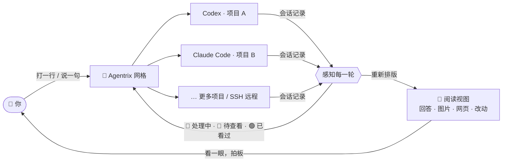

<p align="center">
  <a href="https://github.com/noeigenstate/Agentrix/releases/latest"></a>
</p>

<p align="center"><strong>面向未来的 AI 编辑器：你不再逐行写代码，而是指挥一整张网格的 AI。</strong></p>
<p align="center">Codex 和 Claude Code 在一张网格里同时开发多个项目：它们干活、汇报、等你拍板。</p>

<p align="center">
  <a href="https://github.com/noeigenstate/Agentrix/releases/latest"></a>
  <a href="https://github.com/noeigenstate/Agentrix/releases"></a>
  
  <a href="LICENSE"></a>
</p>

<p align="center">
  <a href="https://github.com/noeigenstate/Agentrix/releases/latest"><strong>⬇️ 下载</strong></a> ·
  <a href="#-一眼看懂">一眼看懂</a> ·
  <a href="#-工作方式">工作方式</a> ·
  <a href="#-亮点">亮点</a> ·
  <a href="#-开始使用">开始使用</a> ·
  <a href="README.en.md">English</a>
</p>

<p align="center">
  
</p>
<p align="center"><sub>30 秒宣传片 · <a href="docs/images/promo.mp4">高清版</a></sub></p>

## ✨ 一眼看懂

<table>
  <tr>
    <td width="33%" valign="top"><h3>🧩 一屏多开</h3>每个项目一张卡片、一个真实终端。Codex 和 Claude Code 同时开工，本地和 SSH 远程项目同在一张网格。</td>
    <td width="33%" valign="top"><h3>💡 做完就亮</h3>读取助手自己的会话记录：🔵 处理中、🩷 做完等你看、🟢 已看过。每一轮只提醒一次，还会用语音告诉你结果。</td>
    <td width="33%" valign="top"><h3>📖 终端变文档</h3>回答排成文档，工具调用折成一行，斜杠命令、权限确认和提问都变成可点的弹窗与卡片。</td>
  </tr>
  <tr>
    <td valign="top"><h3>🖼️ 产物看得见</h3>助手生成的图片、网页、视频、文档直接出现在回答下面，点开就是大图和网页，不用离开对话。</td>
    <td valign="top"><h3>✅ 逐块取舍</h3>按 Git 方式逐块看改动：留下想要的，还原其余的，不用记 <code>git add -p</code>。</td>
    <td valign="top"><h3>🎙️ 开口即指令</h3><kbd>Ctrl</kbd>+<kbd>T</kbd> 说话、回车发送。识别在本机离线完成，录音不上传。</td>
  </tr>
</table>

## 🔭 下一代编辑器

编辑器围着**文件和光标**设计了四十年。AI 写代码之后，真正要管理的是**任务和助手**：哪个在思考，哪个做完了，哪个卡住在等你，它到底改了什么。

| | 在 IDE 里开几个终端 | Agentrix |
| --- | --- | --- |
| **同时做几个项目** | 来回切窗口，靠记忆 | 一张网格全摆开，状态一目了然 |
| **它做完了吗？** | 盯着终端等它安静 | 读会话记录判断，做完亮灯、播报 |
| **它说了什么** | 终端里的字符画 | 排版好的文档，图片和网页直接显示 |
| **它改了什么** | 自己跑 `git diff` | 逐块呈现，一键保留或还原 |
| **给它下指令** | 敲键盘 | 打字或者直接说 |

终端里跑的仍是你自己安装的 `codex` 和 `claude`，按键、配置和交互都不变。

## 🧠 工作方式



## 🚀 亮点

### 🧩 一屏指挥所有项目


- 🔵 **泛蓝**：正在处理，不用管它
- 🩷 **粉色呼吸、语音播报**：这一轮做完了，等你查看
- 🟢 **绿色**：已经看过，随时下达下一条指令

状态读自 Codex 和 Claude Code 记录的会话轮次，而不是猜终端安静了多久：子任务结束不算，命令跑完不算，只有主任务这一轮真正结束才提醒，每条指令只提醒一次。卡片可以拖动排序、点顶栏放大、一键缩回，终端会话和没发出的草稿都不会丢；同一个项目可以开多个终端分屏。

### 📖 终端，被重新排版


把 Claude Code 或 Codex 的对话切换成**阅读视图**：标题、列表、表格、带「复制」按钮的代码块，工具调用折叠成一行。底部输入框直接写进下面的真实终端，随时切回终端。

- **产物就在回答里。** 助手写出或提到的图片、网页、视频、Markdown 直接显示在回答下面；点一下在当前窗口弹出大图、网页或文档，Esc 关闭，不会跳进项目页，也不会打开别的程序。Agentrix 启动它们时会告诉它们这一点，所以它们会直接把图片「给你看」，而不是说「终端只能显示文字」。
- **CLI 的输出也重新渲染。** `/usage`、`/status`、`/context` 等斜杠命令的结果以弹窗呈现：边框去掉，统计排成对照表，用量变成进度条。输入 `/` 列出全部命令，`@` 提及项目文件。
- **提问和确认变成卡片。** 权限确认、`/model` 之类的选择，以及 Claude Code（AskUserQuestion）和 Codex（Plan 模式）向你提的问题，都是可以直接点选的卡片；它正在做什么也像 CLI 一样写在对话末尾，带计时和「Esc 中断」。

右侧**活动栏**顶部固定本轮的调用、完成、失败和用时；实时动态逐条写明它做了什么：命令原文、用了哪个技能、调用了哪个 MCP 工具、新建或修改了哪些文件；下方是正在处理和排队的任务。

> 阅读视图目前支持 **Claude Code** 和 **Codex**。OpenCode、Gemini CLI 等其他命令行助手照常在卡片的终端里运行。

### ✅ 逐块取舍


一轮做完，在 Git 栏点开改动的文件，按 `git diff` 的方式逐块显示。**每一块单独决定**：保留就加入暂存区，不要就还原；已暂存的可以取消，删掉的文件能找回。

### 🎙️ 开口即指令


按 <kbd>Ctrl</kbd>+<kbd>T</kbd> 对当前终端说话，回车发送。识别在本机离线完成，**录音不上传**，无需 API 密钥；可选「高精度 · 中英混合」模型。一轮做完时会用自然的女声播报结果，也可以让助手自己总结一句，或接入云端模型、Ollama / vLLM 等本地模型来总结。

### 🔑 从安装到登录，都在窗口里

- **没装也能开始**：新项目卡片上会标出没装的助手，点一下一键安装，装好就启动；连 Node.js 都没有时会带你去下载。
- **第一次启动不卡住**：信任文件夹、选主题、选登录方式、更新提示都变成弹窗；登录时弹出「登录 Claude Code / Codex」窗口，一键在浏览器打开登录页、粘贴授权码或 API Key、复制一次性验证码。授权码只交给 CLI，不会出现在对话或任务列表里。

### 还有这些

- **重开即续上**：启动时恢复上次的终端和 Codex / Claude Code 会话，被打断的任务自动接着做。
- **SSH 远程项目**：沿用 VS Code Remote-SSH 的主机配置，终端、文件、Git、预览都走 SSH，局域网电脑上生成的网页和图片同样能预览。
- **文件就在手边**：目录树、自动保存的编辑器，图片、网页、视频、Markdown 直接预览；<kbd>Ctrl</kbd>+点击（macOS <kbd>⌘</kbd>+点击）终端里的路径，在弹窗里打开。
- **清晰的界面**：深色磨砂玻璃、白色正文，壁纸保持原画亮度；需要最锐利的文字可切换「实色」材质。另有「黑白橙」浅色和「白黑橙」深色两套简洁主题。
- **中英双语、快捷键可改、Windows 自动更新**，第一次打开时会一步步带你上手。

## 📦 开始使用

**需要：** Windows 10 / 11 x64，Apple 芯片的 Mac（macOS 12 或更高），或 64 位 Linux 桌面（x64 / arm64）。[Codex CLI](https://github.com/openai/codex) 或 [Claude Code](https://docs.anthropic.com/claude-code) 没装也没关系，点项目卡片就能一键安装。

1. **安装**：从 [Releases](https://github.com/noeigenstate/Agentrix/releases/latest) 下载对应平台的版本（见下）。
2. **添加项目**：按 <kbd>Ctrl</kbd>+<kbd>Shift</kbd>+<kbd>N</kbd> 选择项目文件夹，可以一次选多个，也可以添加 SSH 远程项目。
3. **下达指令**：在卡片上选 Claude Code 或 Codex，接着这个文件夹上次的对话或开始新开发；第一次用会弹窗带你登录。说出要做的事，然后去忙别的，粉色亮起时回来看结果。

| 平台 | 下载 | 说明 |
| --- | --- | --- |
| **Windows** | `Agentrix-Setup-<版本>-x64.exe` | 安装后自动更新 |
| **macOS** | 终端运行下面的命令 | 安装或更新都用同一条命令；应用为临时签名，未经 Apple 公证 |
| **Linux** | `Agentrix-<版本>-linux-<架构>.AppImage` | `chmod +x` 后直接运行；也提供 `.tar.gz` |

```bash
curl -fsSL https://raw.githubusercontent.com/noeigenstate/Agentrix/main/scripts/install-macos.sh | bash
```

指定版本、手动安装、macOS 与 Linux 的终端和快捷键细节，见 [使用文档](docs/usage.md#安装细节)。

<details>
<summary><strong>⌨️ 常用快捷键</strong>（都可以在设置里改；macOS 同样使用 Control）</summary>

| 快捷键 | 功能 |
| --- | --- |
| <kbd>Ctrl</kbd>+<kbd>Shift</kbd>+<kbd>N</kbd> | 添加项目 |
| <kbd>Ctrl</kbd>+<kbd>Shift</kbd>+<kbd>Enter</kbd> | 放大或还原当前项目 |
| <kbd>Ctrl</kbd>+<kbd>Shift</kbd>+<kbd>G</kbd> | 返回总览 |
| <kbd>Ctrl</kbd>+<kbd>Tab</kbd> / <kbd>Ctrl</kbd>+<kbd>Shift</kbd>+<kbd>Tab</kbd> | 下一个 / 上一个项目 |
| <kbd>Ctrl</kbd>+<kbd>Shift</kbd>+<kbd>T</kbd> | 当前项目新建终端并分屏 |
| <kbd>Ctrl</kbd>+<kbd>Shift</kbd>+<kbd>W</kbd> | 移除当前项目（文件保留） |
| <kbd>Ctrl</kbd>+<kbd>T</kbd> | 语音输入，回车发送，Esc 取消 |
| <kbd>Ctrl</kbd>+<kbd>Shift</kbd>+<kbd>F</kbd> | 搜索项目 |
| <kbd>Ctrl</kbd>+<kbd>B</kbd> | 展开或收起目录栏 |
| <kbd>F11</kbd> | 窗口全屏 |
| <kbd>Ctrl</kbd>+<kbd>,</kbd> | 设置 |

</details>

## ❓ 常见问题

<details>
<summary><strong>我的代码和数据会被上传吗？</strong></summary>

Agentrix 本身**不收集任何数据，没有统计上报**。它只会访问 GitHub（检查更新）和 Hugging Face 或其国内镜像（首次下载离线语音模型）。只有你在设置里主动选择用云端模型总结播报时，才会把那一轮的最终回复发给你选的服务商。Codex 和 Claude Code 与各自服务的通信，和你平时在终端里使用时一样。

</details>

<details>
<summary><strong>和在 IDE 里开几个终端有什么不同？</strong></summary>

终端还是那个终端，区别在于 Agentrix **知道每个 AI 助手处在什么状态**：它读取 Codex 和 Claude Code 的会话记录，准确判断这一轮是在处理、做完了还是被中断，并把回答、命令结果、图片网页和改动重新排版给你看。它是为「同时指挥多个 AI 任务」设计的，而不是为「一个人编辑一个文件」设计的。

</details>

<details>
<summary><strong>会改动我的 Codex / Claude Code 配置吗？</strong></summary>

不会。完成提醒用的钩子和「阅读视图能显示图片」的说明都在启动时临时传入，不写入你的配置文件，你自己的 hook、设置和指令照常生效，你在命令行里另外指定的同类参数优先。

</details>

更多细节（会话恢复、SSH、文件预览、播报方式、开发与发布）见 [使用文档](docs/usage.md)。

## 🗺️ 路线图

- [ ] 右侧栏按需求和 Bug 列出完成情况与修复次数
- [ ] 开发概览：每个需求和 Bug 花了多少 token、多少钱、多少时间
- [ ] 播报音色选择与声音克隆
- [ ] 更多 CLI 的阅读视图（OpenCode、Gemini CLI 等）
- [ ] WSL 工作区

有想法？欢迎提 [Issue](https://github.com/noeigenstate/Agentrix/issues)。觉得有用的话，点个 ⭐ Star。

## 🛠️ 参与开发

```bash
git clone https://github.com/noeigenstate/Agentrix.git
cd Agentrix
npm ci
npm start              # 开发运行
npm test               # 单元测试
npm run test:desktop   # 真实桌面交互测试
npm run dist           # 构建 Windows 安装版（macOS：dist:mac，Linux：dist:linux）
```

Electron · React · TypeScript · xterm.js · node-pty。每个版本都通过单元测试、打包版桌面测试和 Linux SSH 集成测试后才发布。截图由 `scripts/readme-shots.mjs` 从演示项目生成，宣传片由 `scripts/promo/` 逐帧渲染。

## 📄 许可证

[MIT](LICENSE)。

---

<p align="center">
  <strong>让 AI 去干活，让注意力回到需要你的地方。</strong><br />
  <a href="https://github.com/noeigenstate/Agentrix/releases/latest">下载体验</a> ·
  <a href="https://github.com/noeigenstate/Agentrix/issues">反馈与建议</a>
</p>
