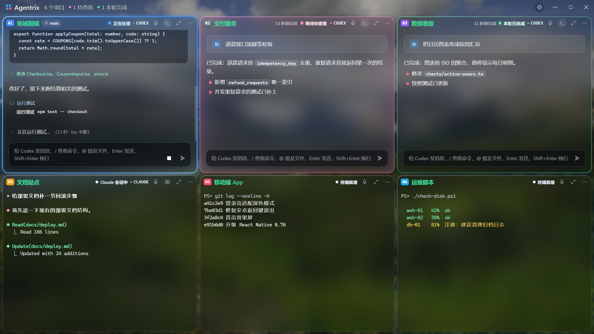
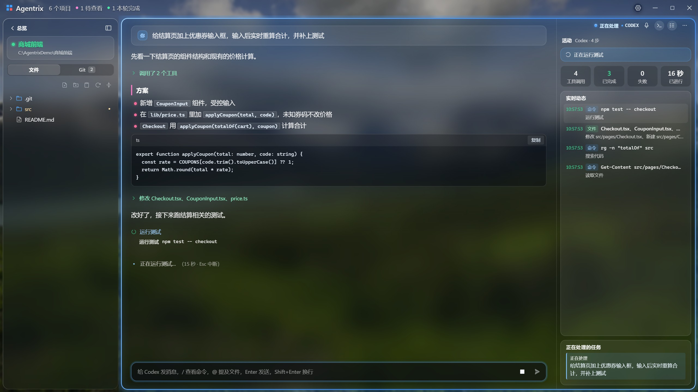
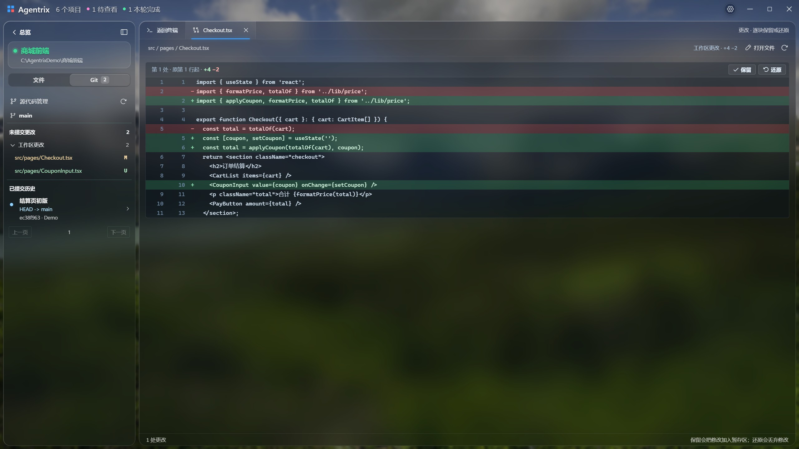
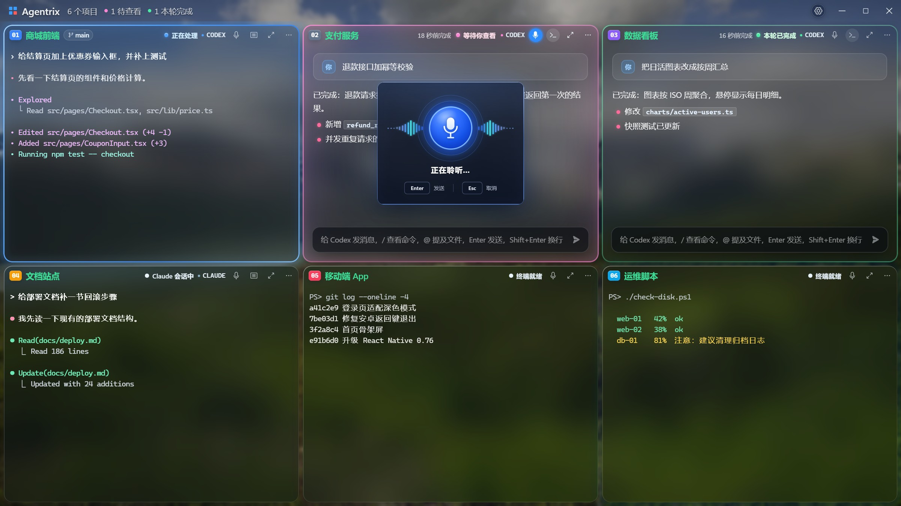

<p align="center">
  
</p>

<h1 align="center">Agentrix</h1>

<p align="center"><strong>面向未来的 AI 编辑器：你不再逐行写代码，而是指挥一整张网格的 AI。</strong></p>
<p align="center">Codex 和 Claude Code 在一张网格里并行开发多个项目，它们干活、汇报、等你拍板。<br />Windows · macOS · Linux</p>

<p align="center">
  <a href="https://github.com/noeigenstate/Agentrix/releases/latest"></a>
  <a href="https://github.com/noeigenstate/Agentrix/releases"></a>
  
  
  <a href="LICENSE"></a>
</p>

<p align="center">
  <a href="https://github.com/noeigenstate/Agentrix/releases/latest"><strong>⬇️ 下载</strong></a> ·
  <a href="#下一代编辑器">理念</a> ·
  <a href="#亮点">亮点</a> ·
  <a href="#开始使用">开始使用</a> ·
  <a href="README.en.md">English</a>
</p>

<p align="center">
  
</p>
<p align="center"><sub>30 秒宣传片 · <a href="docs/images/promo.mp4">高清版</a></sub></p>

## 下一代编辑器

编辑器围着**文件和光标**设计了四十年。AI 写代码之后，真正要管理的是**任务和助手**：哪个在思考，哪个做完了，哪个卡住在等你，它到底改了什么。

Agentrix 从这里重新设计编辑器：

- **并行，而不是排队。** 每个项目一张卡片、一个真实终端，Codex 和 Claude Code 同时开工。
- **感知，而不是盯屏。** 它读取助手自己的会话记录，知道每一轮在做什么、何时结束、何时需要你，并用光、通知和声音叫你回来。
- **重写，而不是照搬。** 终端里的字符画被重新排版成文档：回答、工具调用、命令结果、提问，都以最易读的形式出现。
- **取舍，而不是全盘接受。** 改动逐块呈现，留下想要的，还原其余的。

终端里跑的仍是你自己安装的 `codex` 和 `claude`，按键、配置和交互都不变。

## 亮点

### 🧩 一屏指挥所有项目



- 🔵 **泛蓝**：正在处理，不用管它
- 🩷 **粉色呼吸、语音播报**：这一轮做完了，等你查看
- 🟢 **绿色**：已经看过，随时下达下一条指令

状态读自 Codex 和 Claude Code 记录的会话轮次，而不是猜终端安静了多久：子任务结束不算，命令跑完不算，只有主任务这一轮真正结束才提醒，每条指令只提醒一次。卡片可以拖动排序、点开放大、一键缩回，终端会话和没发出的草稿都不会丢；同一个项目可以开多个终端分屏，本地项目和 SSH 远程项目同在一张网格里。

### 📖 终端，被重新排版



一键把 Claude Code 或 Codex 的对话切换成**阅读视图**：标题、列表、表格、带「复制」按钮的代码块，工具调用折叠成一行。底部输入框直接写进下面的真实终端，随时切回终端。

> 阅读视图目前支持 **Claude Code** 和 **Codex**。OpenCode、Gemini CLI 等其他命令行助手照常在卡片的终端里运行，阅读视图会陆续支持更多 CLI。

- **CLI 的输出也重新渲染。** `/usage`、`/status`、`/context` 这类斜杠命令的结果不再是字符画：边框去掉，统计排成对照表，用量变成进度条，分组加上小标题，直接排进对话，关闭后也留在原处。输入 `/` 列出全部命令，`@` 提及项目文件。
- **提问和确认变成卡片。** 权限确认、`/model` 之类的选择，以及 Claude Code（AskUserQuestion）和 Codex（Plan 模式）向你提的问题，都是可以直接点选的卡片；它正在做什么也像 CLI 一样写在对话末尾，带计时和「Esc 中断」。

右侧**活动栏**顶部固定本轮的调用、完成、失败和用时；实时动态逐条写明它做了什么：命令原文、用了哪个技能、调用了哪个 MCP 工具、新建或修改了哪些文件；下方是正在处理和排队的任务。

### ✅ 逐块取舍



一轮做完，在 Git 栏点开改动的文件，按 `git diff` 的方式逐块显示。**每一块单独决定**：保留就加入暂存区，不要就还原；已暂存的可以取消，删掉的文件能找回。不用离开窗口，也不用记 `git add -p`。

### 🎙️ 开口即指令



按 **Ctrl+T** 对当前终端说话，回车发送。识别在本机离线完成，**录音不上传**，无需 API 密钥；可选「高精度 · 中英混合」模型。一轮做完时会用自然的女声播报结果，也可以让助手自己总结一句，或接入云端模型、Ollama / vLLM 等本地模型来总结。

### 还有这些

- **重开即续上**：启动时恢复上次的终端和 Codex / Claude Code 会话，被打断的任务自动接着做。
- **SSH 远程项目**：沿用 VS Code Remote-SSH 的主机配置，终端、文件、Git、预览都走 SSH，项目不用下载到本地。
- **文件就在手边**：目录树、自动保存的编辑器，图片、网页、视频、Markdown 直接预览；`Ctrl+点击`（macOS `⌘+点击`）打开终端里的路径和链接。
- **清晰的界面**：深色磨砂玻璃、白色正文，按系统和屏幕分辨率调校字体边缘；需要最锐利的文字可切换「实色」材质。另有「黑白橙」浅色和「白黑橙」深色两套简洁主题，终端字体、字重和背景透明度都可调。
- **中英双语、快捷键可改、Windows 自动更新**，第一次打开时会一步步带你上手。

## 开始使用

**需要：** Windows 10 / 11 x64，Apple 芯片的 Mac（macOS 12 或更高），或 64 位 Linux 桌面（x64 / arm64）；以及 [Codex CLI](https://github.com/openai/codex) 或 [Claude Code](https://docs.anthropic.com/claude-code) 至少一个——没装也可以在「设置 › 编码助手」里一键安装。

1. **安装**：从 [Releases](https://github.com/noeigenstate/Agentrix/releases/latest) 下载对应平台的版本（见下）。
2. **添加项目**：按 `Ctrl+Shift+N` 选择项目文件夹，可以一次选多个，也可以添加 SSH 远程项目。
3. **下达指令**：在卡片上选 Claude Code 或 Codex——可以接着这个文件夹上次的对话，也可以开始新开发——说出要做的事，然后去忙别的。粉色亮起时回来看结果。其他命令行助手点「只打开终端」运行。

| 平台 | 下载 | 说明 |
| --- | --- | --- |
| **Windows** | `Agentrix-Setup-<版本>-x64.exe` | 安装后自动更新 |
| **macOS** | 终端运行下面的命令 | 安装或更新都用同一条命令；应用为临时签名，未经 Apple 公证 |
| **Linux** | `Agentrix-<版本>-linux-<架构>.AppImage` | `chmod +x` 后直接运行；也提供 `.tar.gz` |

```bash
curl -fsSL https://raw.githubusercontent.com/noeigenstate/Agentrix/main/scripts/install-macos.sh | bash
```

指定版本、手动安装、macOS 与 Linux 的终端和快捷键细节，见 [使用文档](docs/usage.md#安装细节)。

<details>
<summary><strong>常用快捷键</strong>（都可以在设置里改；macOS 同样使用 Control）</summary>

| 快捷键 | 功能 |
| --- | --- |
| `Ctrl + Shift + N` | 添加项目 |
| `Ctrl + Shift + Enter` | 放大或还原当前项目 |
| `Ctrl + Shift + G` | 返回总览 |
| `Ctrl + Tab` / `Ctrl + Shift + Tab` | 下一个 / 上一个项目 |
| `Ctrl + Shift + T` | 当前项目新建终端并分屏 |
| `Ctrl + T` | 语音输入，回车发送，Esc 取消 |
| `Ctrl + Shift + F` | 搜索项目 |
| `Ctrl + B` | 展开或收起目录栏 |
| `F11` | 窗口全屏 |
| `Ctrl + ,` | 设置 |

</details>

## 常见问题

<details>
<summary><strong>我的代码和数据会被上传吗？</strong></summary>

Agentrix 本身**不收集任何数据，没有统计上报**。它只会访问 GitHub（检查更新）和 Hugging Face 或其国内镜像（首次下载离线语音模型）。只有你在设置里主动选择用云端模型总结播报时，才会把那一轮的最终回复发给你选的服务商。Codex 和 Claude Code 与各自服务的通信，和你平时在终端里使用时一样。

</details>

<details>
<summary><strong>和在 IDE 里开几个终端有什么不同？</strong></summary>

终端还是那个终端，区别在于 Agentrix **知道每个 AI 助手处在什么状态**：它读取 Codex 和 Claude Code 的会话记录，准确判断这一轮是在处理、做完了还是被中断，并把回答、命令结果和改动重新排版给你看。它是为「同时指挥多个 AI 任务」设计的，而不是为「一个人编辑一个文件」设计的。

</details>

<details>
<summary><strong>会改动我的 Codex / Claude Code 配置吗？</strong></summary>

不会。完成提醒所需的设置在启动时临时传入，不写入你的配置文件，你自己的 hook 和设置照常生效。

</details>

更多细节——会话恢复、SSH、文件预览、播报方式、开发与发布——见 [使用文档](docs/usage.md)。

## 路线图

- [ ] 项目分组与快捷切换
- [ ] 更多 CLI 的阅读视图（OpenCode、Gemini CLI 等）
- [ ] 每一轮的结果与产物记录，方便回看
- [ ] WSL 工作区

有想法？欢迎提 [Issue](https://github.com/noeigenstate/Agentrix/issues)。觉得有用的话，点个 ⭐ Star。

## 参与开发

```bash
git clone https://github.com/noeigenstate/Agentrix.git
cd agentrix
npm ci
npm start              # 开发运行
npm test               # 单元测试
npm run test:desktop   # 真实桌面交互测试
npm run dist           # 构建 Windows 安装版（macOS：dist:mac，Linux：dist:linux）
```

Electron · React · TypeScript · xterm.js · node-pty。每个版本都通过单元测试、打包版桌面测试和 Linux SSH 集成测试后才发布。截图由 `scripts/readme-shots.mjs` 从演示项目生成，宣传片由 `scripts/promo/` 逐帧渲染。

## 许可证

[MIT](LICENSE)。

---

<p align="center">
  <strong>让 AI 去干活，让注意力回到需要你的地方。</strong><br />
  <a href="https://github.com/noeigenstate/Agentrix/releases/latest">下载体验</a> ·
  <a href="https://github.com/noeigenstate/Agentrix/issues">反馈与建议</a>
</p>
