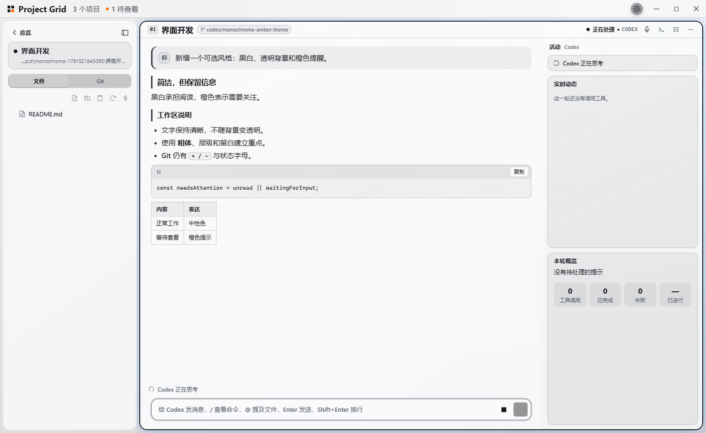
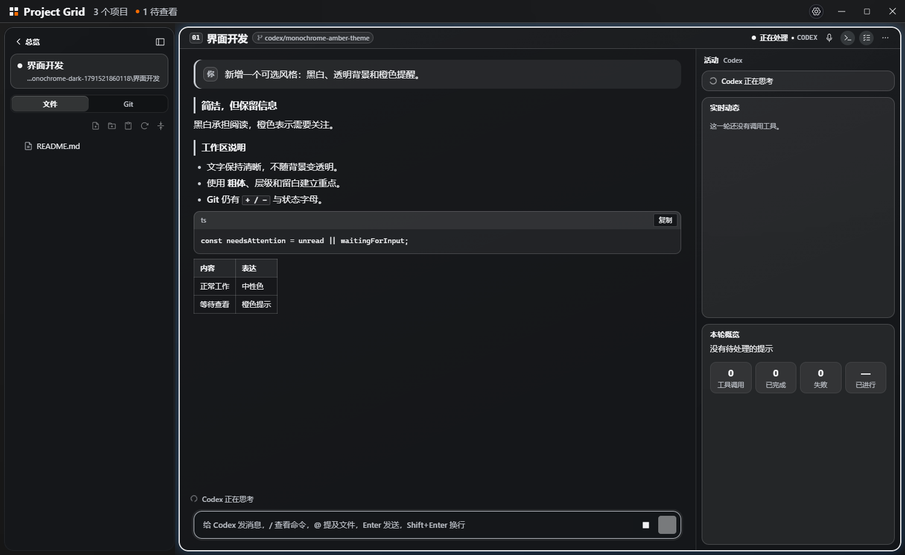

# 增量功能说明：可选简洁主题与玻璃背景

本次贡献在 0.6.12 的外观设置中增加可选项，保持原有自然壁纸主题及默认配置。用户可选择浅色「黑白橙」或深色「白黑橙」，调整玻璃背景透明度、终端字体与字重，或手动应用当前主题的推荐配置。

## README 可用短文

### 中文

**可选简洁外观。** 浅色「黑白橙」与深色「白黑橙」用黑白文字建立阅读层级，以橙色突出待查看、等待确认和错误。终端、阅读视图、文件与 Git 保持同一配色语言；Git 保留状态字母和 `+ / −`，终端程序的 RGB 真彩色输出保持原样。设置中可调整终端西文/中文后备字体、字重和玻璃背景透明度；「应用推荐配置」只在点击时调整外观，切换主题保留手动配置。液态玻璃支持选择主题背景，或在平台支持时模糊窗口背后的桌面内容。

桌面背景首次启用需要重新打开应用。Windows 10 与较早的 Windows 11 使用实验兼容路径，支持最大化与窗口内展开，暂不支持系统全屏；Windows 11 22H2+/macOS 接入原生材质 API，尚待实机验证；不支持的平台保留主题背景。字体从本机调用，不自动下载或随应用分发。

### English

**Optional monochrome appearance.** Light Monochrome Amber and dark White, Black & Amber use neutral text with orange attention signals. The terminal, reading view, files and Git share the palette; Git retains status letters and `+ / −`, while terminal programs keep their RGB truecolor output. Choose installed terminal fonts, adjust weight and glass transparency, or explicitly apply the current theme's recommendations. Theme changes keep manual adjustments. Liquid glass can use the theme background or, on supported platforms, blur content behind the window.

Enabling desktop glass initially requires reopening the app. The experimental Windows 10/older Windows 11 path supports maximising and in-window expansion, but not native fullscreen. Windows 11 22H2+/macOS use native material APIs and still need hardware validation; unsupported systems retain the theme background. Fonts are called from the local installation, without downloads or bundled font files.

## 可用截图素材

以下为真实界面与独立演示项目，采用主题背景模式。截图用于说明主题与阅读/Git 配色，不代表 Windows 11 22H2+/macOS 的实机验证，也不将应用内背景截图描述成真实桌面模糊。

| 素材 | 内容 | README 路径 |
| --- | --- | --- |
| 浅色总览 | 中性终端与橙色待查看卡片 | `docs/images/appearance-light-overview.png` |
| 深色总览 | 中性终端与橙色待查看卡片 | `docs/images/appearance-dark-overview.png` |
| 浅色阅读视图 | 黑字、浅色卡片、中性标题与代码 | `docs/images/appearance-light-reading.png` |
| 深色阅读视图 | 白字、深色卡片、中性标题与代码 | `docs/images/appearance-dark-reading.png` |
| 浅色 Git | 增删前缀、纹理与边线 | `docs/images/appearance-light-git.png` |
| 深色 Git | 增删前缀、纹理与边线 | `docs/images/appearance-dark-git.png` |





README 可直接使用以下片段；发布时沿用已有章节结构即可：

```html
<table>
  <tr>
    <td></td>
    <td></td>
  </tr>
  <tr><td align="center">黑白橙 · 浅色</td><td align="center">白黑橙 · 深色</td></tr>
</table>
```

## 用户操作与默认行为

1. 打开「工作台设置 → 外观」，选择主题。
2. 在「界面材质」选择原有的液态玻璃或实色。玻璃下才显示「玻璃背景」，可选主题背景或桌面背景；六套主题均适用。
3. 玻璃透明度可跟随主题或自定义；0% 不透明，100% 最透明。只改变背景，正文保持原透明度。标题栏和弹窗保留更实的底色，以稳定操作文字的对比度。
4. 终端字体调用已安装字体。西文使用等宽字体；中文选择作为缺字后备。留空沿用原字体栈，未安装的字体继续回退；自定义字体栈额外包含 Linux 常见的 DejaVu Sans Mono/Liberation Mono，位于中文后备之前。字体配置作用于终端，不替换阅读正文和界面的字体栈。
5. 字重可选 400/500/600。点击「应用推荐配置」才会调整外观；不会改动通知、声音、会话恢复或快捷键。

切换实色时隐藏背景选项并保留选择，切回玻璃恢复。普通窗口首次选择桌面背景会显示重开提示；不会自动关闭、重启或重建正在使用的终端。系统减少透明度偏好优先。不支持或启用失败时使用应用内背景。

## 推荐配置

| 主题 | 字号 / 字重 | 字体 | 渲染 | 背景 | 透明度 |
| --- | --- | --- | --- | --- | --- |
| 原有四套主题 | 12 px / 500 | 原字体栈 | GPU | 主题背景 | 跟随原主题 |
| 黑白橙 | 16 px / 400 | Cascadia Code + Noto Sans SC | 兼容 DOM | 支持时桌面背景 | 25% |
| 白黑橙 | 16 px / 400 | Cascadia Code + Noto Sans SC | 兼容 DOM | 支持时桌面背景 | 20% |

这些是建议而非主题切换时强制应用的参数。未安装推荐字体时继续回退；主观观感仍与字体版本、系统与显示器有关。高透明度下仍需要用户根据真实背景调整。

## 合并范围与兼容性

- 增加两个主题 ID；原四套主题、默认晴空、终端原调色板和业务流程保留。
- 增加五项设置：`glassBackground` 默认 `theme`；`glassTransparency` 默认 `null`；`terminalFontWeight` 默认 `500`；`terminalFontFamily` / `terminalCjkFontFamily` 默认空字符串。无需迁移旧工作区文件。
- 早期本地预览的 `surface=desktop-glass` 清理为 `surface=glass` + `glassBackground=desktop`；公开材质仍只有两个值。
- 原生背景接入集中在一个模块与 Windows 兼容助手；不增加生产依赖、原生 addon 或字体文件。
- 字体变化只更新现有终端并重新计算尺寸；会话、未发草稿与缓冲区保持。额外的 xterm 6.0 DOM 选区缓存兼容修复用守卫接入现有渲染适配入口；升级 xterm 时应重新核对其内部接口。
- Windows 10 兼容路径使用未公开的系统接口，保留实验说明和失败回退。颜色光标限定于该透明窗口，原终端鼠标协议及链接光标保留。
- 字体许可和分发边界见 [font-licenses.md](font-licenses.md)。任意自定义字体仍以其授权为准。

## 维护者可核对的证据

[验证记录](appearance-validation.md)列出范围、可复现命令与平台边界；[机器可读摘要](appearance-evidence.json)保存单元测试、GUI 检查、背景对照及打包审计结果。图片和摘要随本次贡献提交；完整原始日志保留在本地测试输出，不在文档中链接未提交的日志。

截图可用 `npm run test:monochrome` 与 `PROJECT_GRID_MONO_THEME=mono-amber-dark` 的同一检查重新生成，输出目录由脚本打印。素材来自其中的 `overview.png` / `reading.png` / `git-diff.png`。测试均使用独立资料并顺序执行，不操作用户正在使用的窗口或会话。

合并前仍需维护者安排 Windows 11 22H2+/macOS 实机材质验证；Linux 的系统背景保持回退，字体候选顺序经过检查但尚未进行 Linux 实机观感验证。README 不应宣传所有平台效果一致或任意背景下的透明文字都可读。版本号与发布说明由主分支维护者按发布计划决定。
